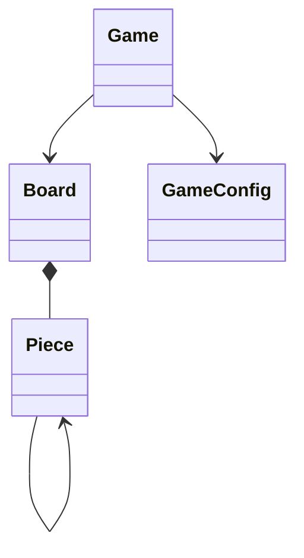

# **Minimalistinen luokkakaavio**


# ** Sekvenssikaaviot
## Ruudun klikkaaminen
```mermaid
sequenceDiagram
    actor Player
    participant Game
    participant Board
    participant Piece

    Player->>Game: click mouse button
    Game->>Game: clicking(position, flagging)
    Game->>Board: get_piece(idx)
    Board-->>Game: piece
    Game->>Board: clicking(piece, flagging)

    alt flagging is True
        Board->>Piece: set_flagged()
        Piece-->>Board: None
    else flagging is False
        Board->>Piece: click()
        Piece->>Piece: revealed = True

        alt piece has mine
            Board->>Board: lost = True
        else piece is empty
            Board->>Board: num_clicked += 1
            Board->>Piece: get_num()
            Piece-->>Board: num

            alt num == 0
                loop for each neighbour
                    Board->>Piece: get_neighbours()
                    Piece-->>Board: neighbours
                    Board->>Board: clicking(neighbour, False)
                end
            end
        end
    end