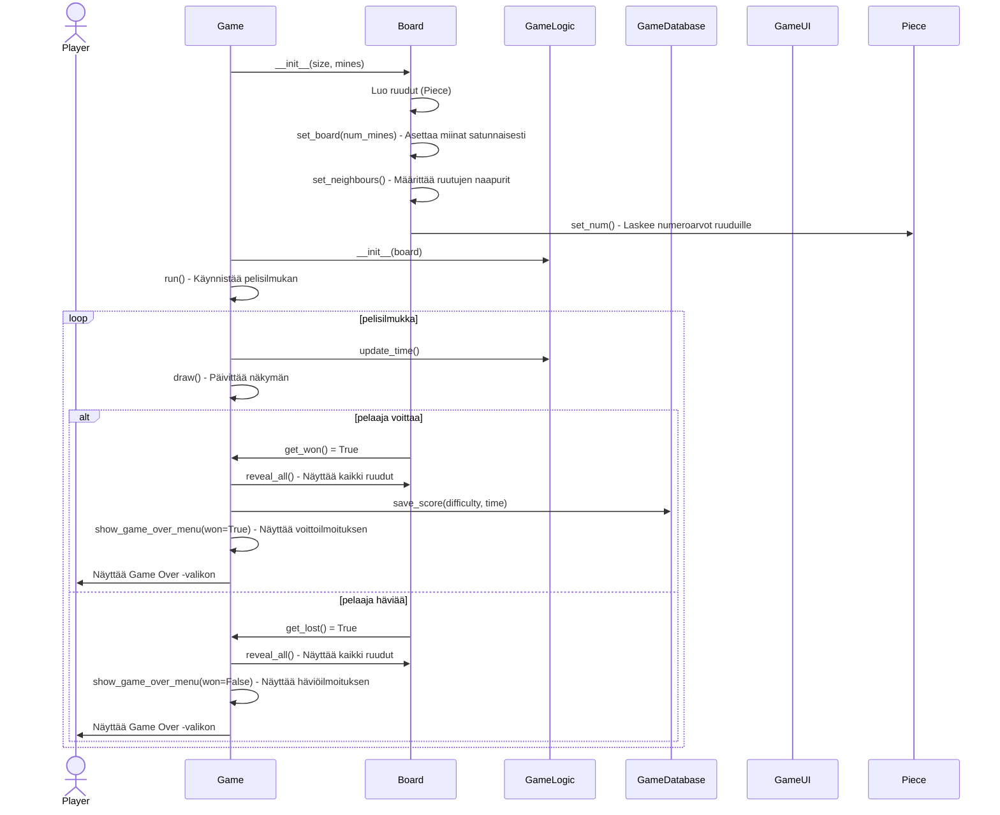
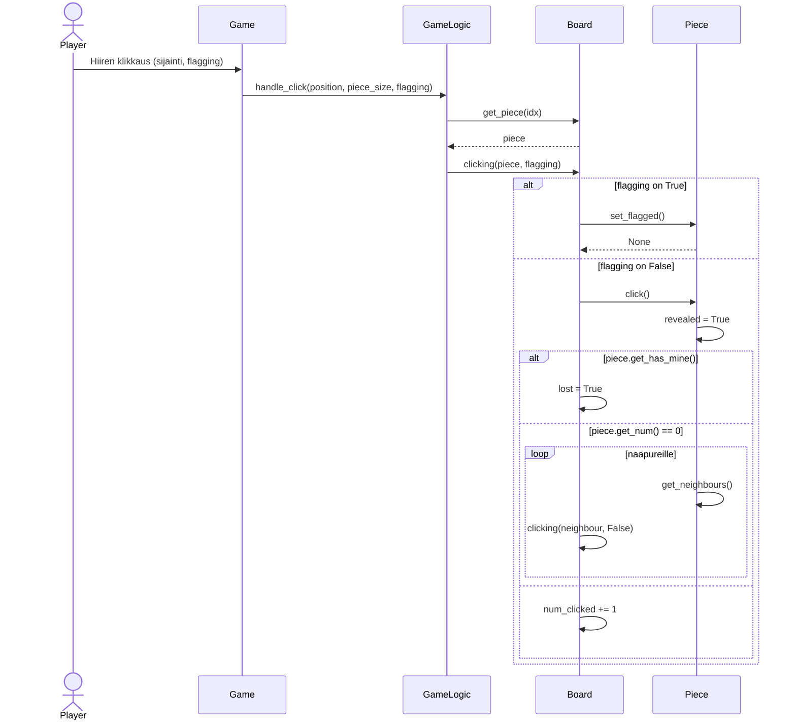
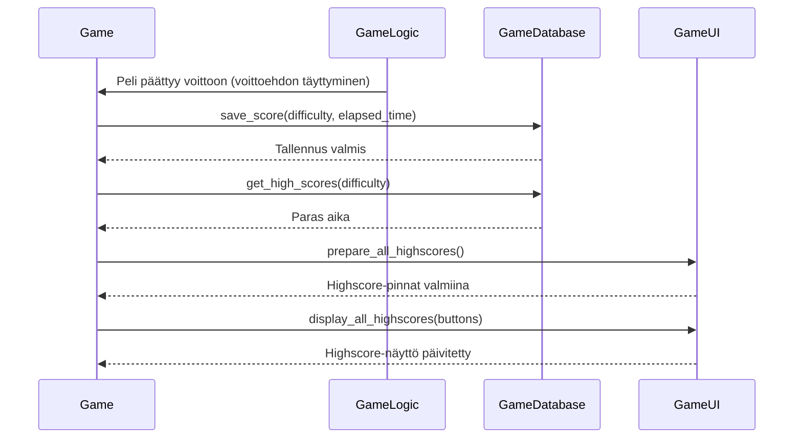

# **Arkkitehtuurikuvaus**

## **Rakenne**
```mermaid
classDiagram
    classDiagram
    Game "1" --> "1" GameUI
    Game "1" --> "1" GameLogic
    Game "1" --> "1" Board
    Game "1" --> "1" GameDatabase
    Game "1" --> "1" CustomGame
    Board "1" *-- "*" Piece
    Piece --> Piece
    CustomGame --> GameUI
    GameLogic --> Board
```

## **Käyttöliittymä**
- Käyttöliittymä sisältää itse pelinäkymän lisäksi kolme erillistä näkymää:
    - Päävalikko
    - Custom-pelimuodon valikko
    - Voitto/häviöruutu

- Käyttöliittymästä vastaa pääasiassa GameUI-luokka, joka tarjoaa metodit näkymien piirtämiseen ja käyttäjän interaktioiden käsittelyyn. Game-luokka toimii koordinaattorina, joka kutsuu GameUI-luokan metodeja tarpeen mukaan.
- Päävalikko on toteutettu Game-luokan main_menu -metodissa, näkymä piirretään GameUI-luokan draw_menu_screen-metodilla
- Custom-pelimudon valikko on toteutettu CustomGame-luokassa metodilla show_settings ja se käyttää GameUI-luokan metodeja käyttöliittymäelementtien kuten liukusäätimien piirtämiseen
- voitto/häviöruudut toteutetaan Game-luokan show_game_over_menu-metodissa, ruutu piirretään näytölle käyttäen GameUI-luokan draw_game_over_background-metodia

## **Päätoiminnallisuudet**

## **Pelin alustus ja voitto/häviötilanteet**

- Pelin alussa Game-luokka luo Board-olion antaen sille pelilaudan koon ja miinojen määrän. Board-luokka alustaa pelilaudan luomalla Piece-oliot jokaiselle ruudulle, asettaa miinat satunnaisesti set_board-metodilla ja määrittää ruutujen naapurit set_neighbours-metodilla. Piece-oliot laskevat ympäröivien miinojen määrät set_num-metodilla. Game luo myös GameLogic-olion, joka saa parametrina pelilaudan. Pelin käynnistyessä Game-luokka aloittaa pelisilmukan run-metodilla, joka päivittää peliaikaa, käsittelee pelaajan syötteet ja piirtää pelilaudan. Pelisilmukassa tarkistetaan jatkuvasti, onko peli voitettu tai hävitty. Jos pelaaja voittaa (kaikki miinattomat ruudut avattu), Board-luokka ilmoittaa voitosta, Game-luokka paljastaa kaikki ruudut, tallentaa tuloksen tietokantaan ja näyttää voittoilmoituksen sekä Game Over -valikon. Jos pelaaja häviää (avaa miinan), Board-luokka ilmoittaa häviöstä, Game-luokka paljastaa kaikki ruudut ja näyttää häviöilmoituksen sekä Game Over -valikon.

## Ruudun klikkaaminen


- Kun pelaaja klikkaa ruutua pelilaudalla, käyttöliittymän tapahtumankäsittelijä kutsuu Game-luokan metodia, joka välittää klikkauksen sijainnin ja mahdollisen lippuasetuksen (flagging) GameLogic -luokalle. GameLogic selvittää Board-luokan avulla, mikä ruutu (Piece-olio) on kyseessä. Board palauttaa Piece-olion, ja GameLogic pyytää Boardia käsittelemään klikkauksen. Jos kyseessä on lippu, Board kutsuu Piece-olion set_flagged-metodia, joka asettaa tai poistaa lipun ruudusta. Jos kyseessä ei ole lippu, Board kutsuu Piece-olion click-metodia, joka paljastaa ruudun. Jos ruudussa on miina, Board asettaa pelin hävityksi. Jos ruudussa ei ole miinaa ja sen arvo on 0, Board avaa rekursiivisesti kaikki naapuriruudut. Muussa tapauksessa Board kasvattaa avattujen ruutujen laskuria. Lopputuloksena pelilauta päivittyy ja peli etenee klikkauksen mukaisesti.

## Highscoren tallennus ja näyttäminen



- Kun peli päättyy voittoon, GameLogic-luokka ilmoittaa Game-luokalle voittoehdon täyttymisestä. Game-luokka kutsuu tietokantakerroksen (GameDatabase) save_score-metodia ja antaa parametriksi vaikeustason sekä peliajan. GameDatabase tarkistaa, onko uusi aika parempi kuin aiempi, ja tallentaa sen tarvittaessa. Tämän jälkeen Game hakee parhaat ajat kutsumalla GameDatabase:n get_high_scores-metodia.  Saatuaan parhaat ajat Game päivittää highscore-näytöt kutsumalla omaa prepare_all_highscores-metodiaan, joka luo highscore-tekstit GameUI:n avulla. Game päivittää highscore-näytöt kutsumalla omia prepare_all_highscores- ja display_all_highscores-metodejaan, jotka käyttävät GameUI:ta piirtämiseen. Näin päivitetyt highscoret näytetään päävalikossa pelaajalle.