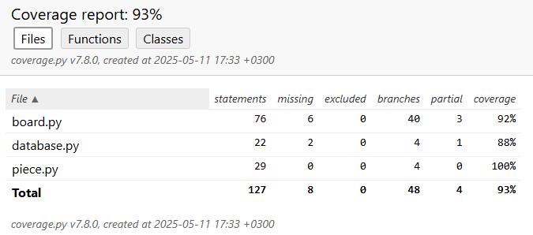

# **Testausdokumentti**
## **Yksikkötestaus**
- Sovelluksen yksikkötestaus on toteutettu unittestilla, tietokantatesteissä on hyödynnetty SQLiten in-memory -tietokantaominaisuutta.

## **Testatut luokat**
- Seuraavia sovelluksen luokkia on testattu:
    - Board (test_board.py)
    - Piece (test_piece.py)
    - GameDatabase (test_database.py)

# **Testikattavuus**

- Testien ulkopuolelle jäivät Game.py tiedoston luokat, sillä ne ovat Pygame-riippuvuuden vuoksi vaikeasti testattavia.

## **Järjestelmätestaus**
- Sovelluksen järjestelmätestaus on suoritettu manuaalisesti sekä Windowsissa, että Cubbli Linux virtuaaliympäristössä.